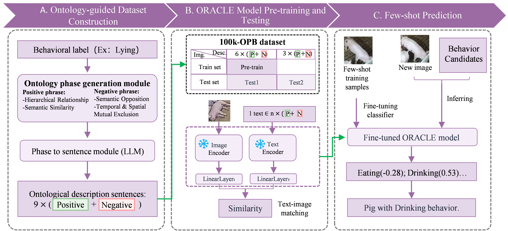
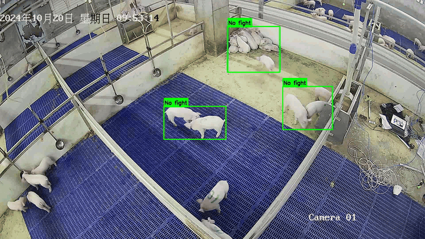

 

# ORACLE

Official code repository for the paper:

**ORACLE: Knowledge-Efficient Pig Behaviour Recognition via Ontology-Guided Contrastive Learning**

ORACLE is an ontology-guided vision-language framework for pig behaviour recognition. The model uses frozen CLIP image and text encoders with lightweight trainable projection heads, and supports evaluation with seen and unseen textual descriptions as well as few-shot downstream adaptation.

## Overview

<p align="center">
  
</p>

ORACLE introduces ontology-guided contrastive learning for knowledge-efficient pig behaviour recognition. The workflow consists of four main components:

1. **Ontology-guided data construction.** Heterogeneous image and video datasets are unified into 24 pig behaviour categories and paired with structured textual descriptions that encode behavioural hierarchy, semantic opposition, and temporal-spatial exclusion.
2. **Frozen vision-language encoding.** Image, video, and text inputs are encoded with frozen CLIP encoders to preserve general visual-language representations while avoiding heavy model retraining.
3. **Lightweight contrastive adaptation.** Trainable projection heads align visual samples with positive behaviour descriptions and separate them from negative descriptions.
4. **Evaluation and downstream adaptation.** The trained model is evaluated on seen descriptions, unseen descriptions, and three few-shot downstream pig production scenarios.

## Demos

### Demo 1. Agonistic behaviour recognition

<table>
  <tr>
    <td align="center">
      </img>
      <br>
      <sub>Example 1</sub>
    </td>
    <td align="center">
      <video src="assets/baoyu2.mp4" width="360" controls></video>
      <br>
      <sub>Example 2</sub>
    </td>
  </tr>
</table>


### Demo 2. Gestating-sow posture recognition

<table>
  <tr>
    <td align="center">
      <video src="assets/muzhu1.mp4" width="360" controls></video>
      <br>
      <sub>Example 1</sub>
    </td>
    <td align="center">
      <video src="assets/muzhu2.mp4" width="360" controls></video>
      <br>
      <sub>Example 2</sub>
    </td>
  </tr>
</table>

### Demo 3. Feeding and drinking recognition

<table>
  <tr>
    <td align="center">
      <video src="assets/yufei1.mp4" width="360" controls></video>
      <br>
      <sub>Example 1</sub>
    </td>
    <td align="center">
      <video src="assets/yufei2.mp4" width="360" controls></video>
      <br>
      <sub>Example 2</sub>
    </td>
  </tr>
</table>

## Installation

```bash
git clone https://github.com/laoli518/Oracle
cd Oracle

conda create -n oracle python=3.10 -y
conda activate oracle

pip install -e .
```

Additional dependencies for downstream fine-tuning scripts:

```bash
pip install pandas openpyxl scikit-learn opencv-python
```

## Dataset

The benchmark dataset contains image and video samples covering 24 pig behaviour categories.

**Dataset download:** [Download 100K-OPB Dataset](https://github.com/laoli518/-100k-OPB-Dataset-)

After downloading the dataset, prepare the JSON split files and media paths required by the training and evaluation scripts. Instructions for preparing JSON split files are provided in the dataset README.

```text
data/
├── train.json
├── test.json
└── descriptions/
    └── test2_unseen_descriptions_example.json
```

## Running ORACLE

### 1. Train the base model

```bash
oracle-train   --train-data data/train.json   --val-data data/test.json   --output-dir outputs/training   --num-frames 25   --motion-alpha 0.5   --epochs 20   --batch-size 128
```

The trained checkpoint is saved to:

```text
outputs/training/best_direct_contrastive_model.pth
```

### 2. Test on seen descriptions: `test1`

`test1` evaluates the trained model using the textual descriptions saved in the trained checkpoint.

```bash
oracle-test1   --model-path outputs/training/best_direct_contrastive_model.pth   --test-data data/test.json   --output-dir outputs/test1_seen_descriptions
```

### 3. Test on unseen descriptions: `test2`

`test2` evaluates the trained model using external descriptions that were not used during training.

```bash
oracle-test2   --model-path outputs/training/best_direct_contrastive_model.pth   --test-data data/test.json   --desc-file data/descriptions/test2_unseen_descriptions_example.json   --output-dir outputs/test2_unseen_descriptions
```

## Few-shot Fine-tuning

The `fine_tuning/` directory contains scripts for adapting a trained ORACLE checkpoint to three downstream pig production scenarios.
See `fine_tuning/README.md` for the three downstream scenarios.

## Project Structure

```text
oracle/
├── README.md
├── pyproject.toml
├── requirements.txt
├── run_training.py
├── run_test1.py
├── run_test2.py
├── assets/
│   ├── oracle logo.png
│   ├── overview.png
│   ├── baoyu1.mp4
│   ├── baoyu2.mp4
│   ├── muzhu1.mp4
│   ├── muzhu2.mp4
│   ├── yufei1.mp4
│   └── yufei2.mp4
├── data/
│   └── descriptions/
│       └── test2_unseen_descriptions_example.json
├── scripts/
│   ├── train_example.sh
│   ├── test1_example.sh
│   └── test2_example.sh
├── src/oracle/
│   ├── cli.py
│   ├── dataset.py
│   ├── features.py
│   ├── model.py
│   ├── trainer.py
│   ├── evaluation.py
│   └── external_evaluation.py
├── fine_tuning/
│   ├── folder_adapter_finetune.py
│   ├── finetune_fight_nofight.py
│   ├── finetune_lying_posture.py
│   ├── finetune_drinking_eating.py
│   └── README.md
└── tests/
```

## Citation

Citation information will be added upon publication of the paper.
